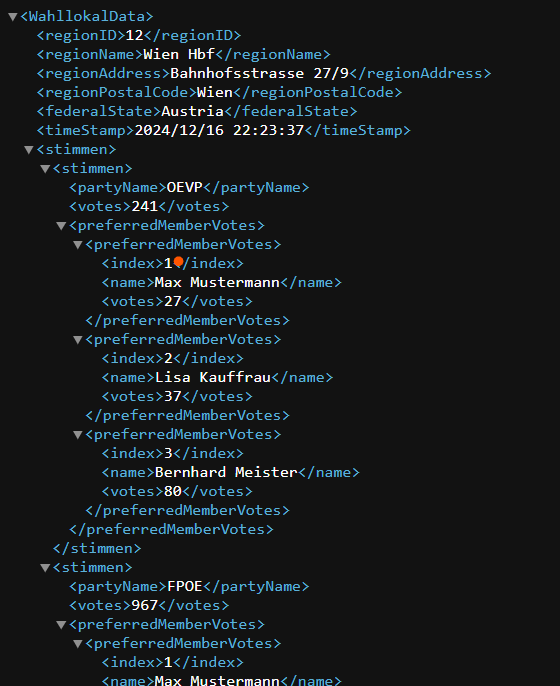
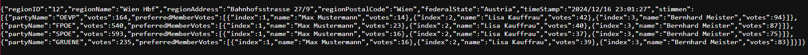

# Dokumentation REST

Rest ist eine Art zu programmieren und sollte verwendet werden, um einfache Web-APIs zu machen. REST wird in Controller, Application, Service und in Daten unterteilt. Controller arbeitet mit HTTP und verarbeitet die Anfragen und zeigt die Daten. 

    /**
     * Der Controller der mit HTTP arbeitet. Wird durch die Notation auch so von Spring interpretiert.
     */
    @RestController
    @RequestMapping("/")
    public class WahllokalController {
    
        @Autowired
        WahllokalService service = new WahllokalService();
        
        @RequestMapping("/s")
        public String wahllokalmain() {
        return "<h>1>Wahllokal</h1>";
        }
        
        /**
         * Zeigt die Daten aus Service an.
         * @param inID ist ein Parameter in der URL
         * @return die Daten aus der Simulation
         */
        @RequestMapping(path = "/{inID}", produces = MediaType.APPLICATION_JSON_VALUE) // Durch den MediaType wird die Anzeige bestimmt hier JSON
        @ResponseBody
        public WahllokalData wohllokaljson(@PathVariable String inID) { // inID ist in der URL ein Parameter
            for(PartyVotes votes : service.getWahllokalData(inID).getStimmen()) {
                System.out.println(votes);
            }
            return service.getWahllokalData(inID);
        }
        
        /**
         * Zeigt die Daten an nur als XML
         * @param inID ist ein Parameter in der URL
         * @return die Daten aus der Simulation
         */
        @RequestMapping(value = "/{inID}/xml", produces = MediaType.APPLICATION_XML_VALUE) // Durch den MediaType wird die Anzeige bestimmt hier XML
        @ResponseBody
        public WahllokalData wohllokalxml(@PathVariable String inID) {
            return service.getWahllokalData(inID);
        }
    
    }

Hier sieht man wie durch die URL was angezeigt wird.

Das ist die XML-Struktur. Man sieht die Daten in einer Struktur, die man durch die Notation festgesetzt hat.

Die JSON-Struktur wird durch den MediaType bestimmt. Und wird auch in den Objekten verankert mit den Attributen.

